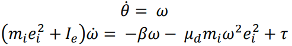
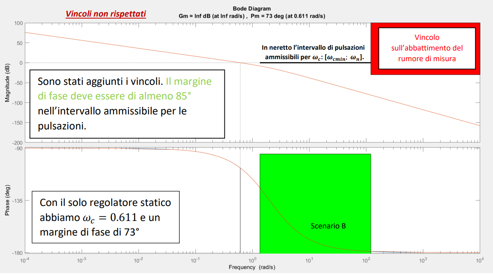
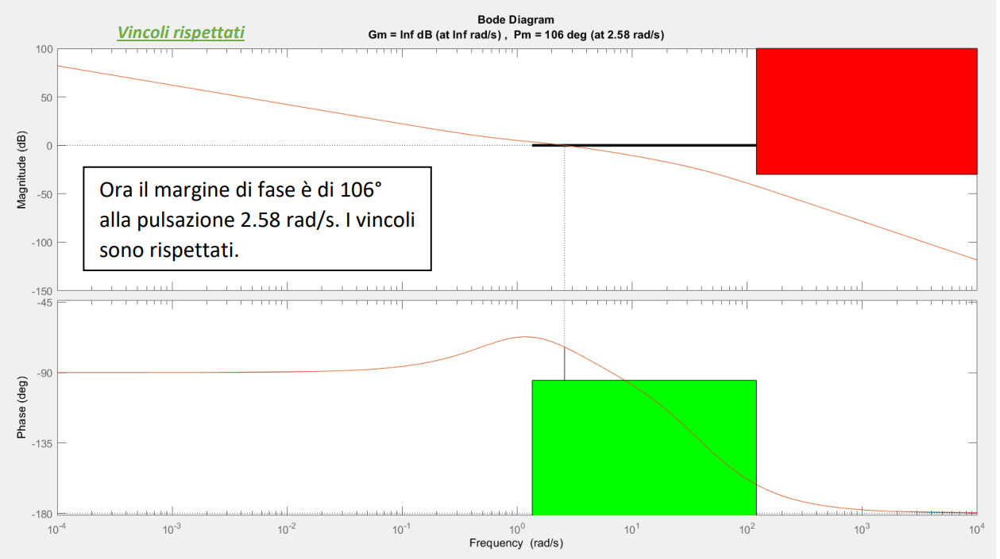
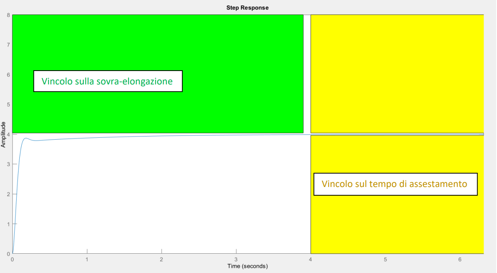
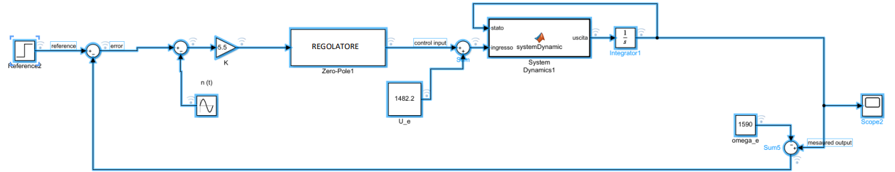
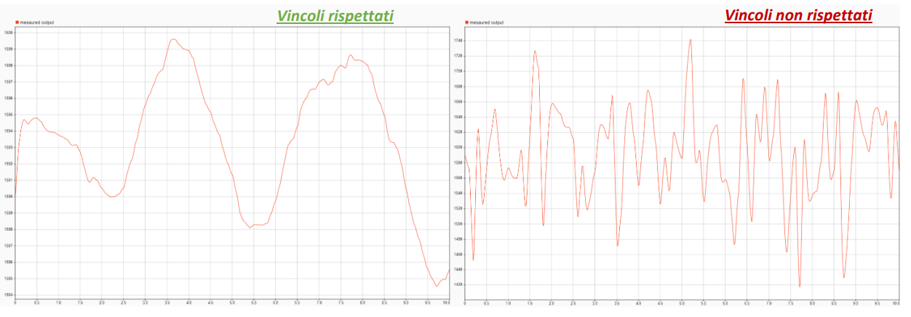

# Speed controller of a vertical axis rotor
This is a university project made for Automatic Control course of prof. Giuseppe Notarstefano at University of Bologna.

## ABSTRACT
The main goal of this project is to desing a control system in order to obtain a constant angular speed of a blades-deformed rotor.
This deformity produces a non-linear system.

   

## Variable Definitions 
𝜔 is angular speed  
𝜃 is the angle of the blade  
β is a coefficient  
𝜇𝑑 is the dynamic friction coefficient  
𝑚𝑖 is the mass located in the deformity point  
𝑒𝑖 is the distance between centre and deformity  
𝐼𝑒 is the moment of inertia   
𝜏 is the force applied to the motor.  

## Results

Following the Bode diagram of the extended system with the constraints.

   

Following the Bode diagram of the L function.

   

Following the Bode diagram of the Step Response function

   

Following the controller design on Simulink

   

Following the difference of the noise after and before the use of a high-pass filter

   

## Credits
- [Giorgio Mocci](https://github.com/giorgio-mocci)
- [Daniel Rajer](https://github.com/telespalladaniel)
